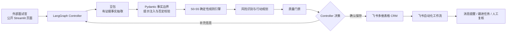

# 阶段十：面试演示手册

## 一句话定位

这是一个基于 LangGraph 与豆包的受控销售商机分析 Agent：大模型理解拜访记录，确定性代码完成事实校验和 S0–S5 判级，飞书负责 CRM 沉淀与协同工作流。

## 架构图

设计原则是“大模型负责理解，代码负责规则，用户负责副作用确认，飞书负责企业协同”。

## Agent 规则说明

- 模型只输出带原文证据的结构化事实，无权直接决定商机阶段。
- 已确认事实必须同时具备值和原文证据。
- 缺失、模糊、否定或矛盾的信息不能触发阶段升级。
- 阶段规则从 S5 向 S0 选择满足条件的最高阶段。
- S3 必须同时存在有效需求和明确商务讨论。
- Controller 根据质量门禁决定追问、确认矛盾、人工复核、等待保存或结束。
- 飞书写入必须由体验者明确点击确认；公开演示默认关闭写入。

## 主要输出字段

| 输出 | 说明 |
| --- | --- |
| 客户名称、需求、核心场景 | 从拜访记录提取的业务事实 |
| 预算、决策人、影响人、时间计划 | 商机资格信息；缺失时标为未确认 |
| 当前阶段与阶段名称 | 确定性规则计算出的 S0–S5 |
| 阶段证据 | 可逐字定位回原文的升级依据 |
| 下一阶段差距 | 当前阶段向下一阶段推进所缺条件 |
| 风险与下一步行动 | 带依据、优先级、负责人和时间的行动建议 |
| Agent 决策 | 追问、复核、等待保存、已保存或结束 |
| 模型与规则版本 | 用于审计、回归和问题定位 |

## 三分钟演示脚本

### 0:00–0:30，业务问题

“销售拜访记录通常是非结构化文本，阶段判断依赖个人经验，容易漏掉预算、决策链和下一步动作。我做的不是聊天机器人，而是一个能理解、判级、追问、调用飞书并受质量门禁约束的 Agent。”

### 0:30–1:15，运行方案验证样例

选择“样例二：方案验证”，点击开始分析。展示：

- 豆包提取需求、场景和客户同意演示的证据；
- 规则引擎判为 S2，而不是模型自由生成阶段；
- 页面指出预算、决策人和采购时间仍未确认；
- Controller 给出补充问题。

### 1:15–2:00，多轮与可解释性

打开 Agent 轨迹和证据区域，说明每一个升级信号都能回到客户原文。补充预算或决策链信息，再次分析，展示阶段和风险如何随新事实重算。

### 2:00–2:35，飞书闭环

展示飞书商机分析表、阶段规则表和已启用工作流。说明确认保存后，多维表格负责沉淀，飞书自动化负责消息、P0 跟进任务和人工复核，外部入口不受组织成员单聊限制。

### 2:35–3:00，质量与边界

展示阶段九测试表：18 条真实豆包用例全部通过，Schema 100%、阶段准确率 100%、事实编造率 0%。最后说明公开页面有限流、长度限制、Secrets 管理和 Mock 故障兜底。

## 自测输入与预期

输入：

> 客户希望解决门店巡检结果分散、整改跟踪困难的问题，同意下周安排产品演示和技术交流。业务负责人会参加，最终决策人、预算和采购时间暂未确认。

预期要点：

- 阶段：S2（方案验证）。
- 确认证据：客户问题、同意下周演示和技术交流。
- 未确认：最终决策人、预算、采购时间。
- 不应升级到 S3，因为没有已确认的商务讨论。
- Controller 应主动追问关键缺口或给出推荐补充问题。

## 异常情况备用方案

| 异常 | 现场处理 |
| --- | --- |
| 豆包超时 | 点击重试；仍失败则使用已开启的 Mock 兜底，并指出页面上的降级标记 |
| 飞书写入失败 | 分析结果不会丢失；展示 JSON 下载和已有飞书联调记录 |
| 公网访问异常 | 使用本地 Streamlit 备用入口，并展示阶段九真实测试报告 |
| 飞书工作流临时不可用 | 展示已启用工作流配置和历史成功执行记录 |
| 面试官输入过短或过长 | 展示输入门禁提示，换用内置样例 |
| 被问“这是不是 Workflow” | 回答：核心是带状态、工具调用、动态追问与 Controller 的 Agent；飞书自动化只是保存后的企业协同 Workflow |

## 提交材料清单

1. 公开 Agent URL。
2. 飞书商机分析表、阶段规则表和测试用例表。
3. 飞书工作流配置与成功运行记录。
4. 项目源代码与 README。
5. 阶段九真实评测报告。
6. 本部署说明与三分钟演示脚本。
